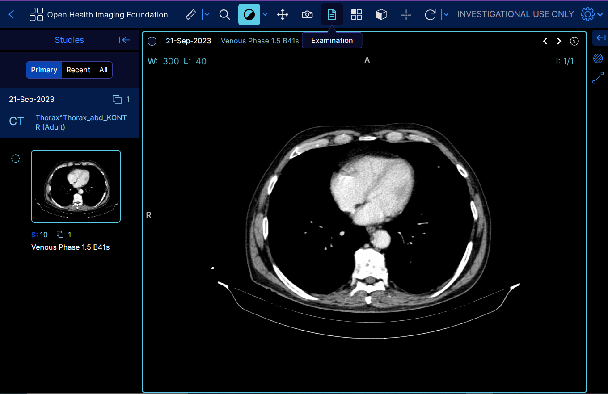
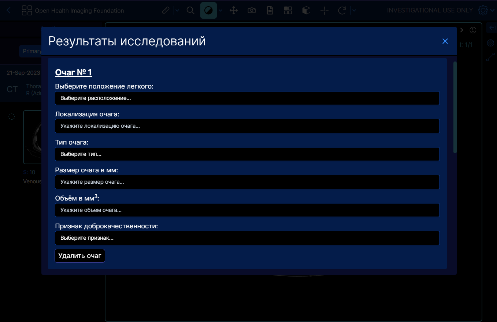
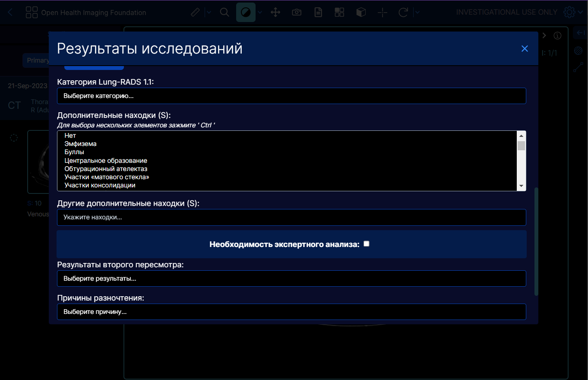
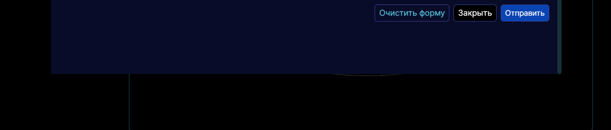

<!-- prettier-ignore-start -->
<!-- markdownlint-disable -->
<div align="center">
  <h1>OHIF Medical Imaging Viewer</h1>
  <p><strong>The OHIF Viewer</strong> is a zero-footprint medical image viewer
provided by the <a href="https://ohif.org/">Open Health Imaging Foundation (OHIF)</a>. It is a configurable and extensible progressive web application with out-of-the-box support for image archives which support <a href="https://www.dicomstandard.org/using/dicomweb/">DICOMweb</a>.</p>
</div>


<div align="center">
  <a href="https://docs.ohif.org/"><strong>Read The Docs</strong></a>
</div>
<div align="center">
  <a href="https://viewer.ohif.org/">Live Demo</a> |
  <a href="https://ui.ohif.org/">Component Library</a>
</div>
<div align="center">
  📰 <a href="https://ohif.org/news/"><strong>Join OHIF Newsletter</strong></a> 📰
</div>
<div align="center">
  📰 <a href="https://ohif.org/news/"><strong>Join OHIF Newsletter</strong></a> 📰
</div>


<hr />

[![NPM version][npm-version-image]][npm-url]
[![MIT License][license-image]][license-url]
[![This project is using Percy.io for visual regression testing.][percy-image]](percy-url)
<!-- [![NPM downloads][npm-downloads-image]][npm-url] -->
<!-- [![Pulls][docker-pulls-img]][docker-image-url] -->
<!-- [](https://app.fossa.io/projects/git%2Bgithub.com%2FOHIF%2FViewers?ref=badge_shield) -->

<!-- [![Netlify Status][netlify-image]][netlify-url] -->
<!-- [![CircleCI][circleci-image]][circleci-url] -->
<!-- [![codecov][codecov-image]][codecov-url] -->
<!-- [](#contributors) -->
<!-- prettier-ignore-end -->

# Версия OHIF Viewer для [DPHT] с протоколом обследования.
«Цифровые технологии в общественном здоровье» Университет [ИТМО] г. Санкт-Петербург.

**Реализация протокола для документирования и отправки результатов обследования при проведении скрининга рака молочной̆ железы, скрининга рака легкого, скрининга диабетической̆ ретинопатии, а также ранней̆ диагностики сердечно-сосудистых заболеваний.**

## Features
- Добавлен протокол результатов обследования
- Реализована отправка введенных данных в хранилище bucket s3
- Загрузка изображений из собственного pacs хранилища
- Сохранение промежуточного протокола (введенных данных)
- Отправляемый файл получает StudyInstanceUID в качестве имени, что позволяет его идентифицировать для дальнейшей работы (в разработке)

Данная модифицированная версия OHIF Medical Imaging Viewer работает в совокупности с другими решениями, разработанными лабораторией [DPHT]. Для использования нашего продукта и ваших предложений перейдите на [сайт] лаборатории и напишите нам.

## Installation
> *Данная версия веб-разметчика полностью поддерживает*
> *весь основной функционал OHIF, а также дополняет его.*
>
> *Установка и среда разработки описана ниже в оригинальной*
> *инструкции OHIF.*
>
> *Вы можете развернуть у себя на локальной машине*
> *изначальный репозиторий OHIF Viewer*
> *и подтянуть изменения из моей ветки [gitHub],*
> *а также установить дополнительные зависимости.*

**Нижеописанные библиотеки необходимы для работы протокола "Examination", без них все остальные функции OHIF также будут работать. Кроме протокола обследования!**
1. Установите [formik](https://formik.org/) командой `yarn add...`
2. Установите [formik-persist](https://www.npmjs.com/package/formik-persist) командой `yarn add...`
3. Установите [flowbite-react](https://www.flowbite-react.com/) командой `yarn add...`
4. Установите [aws-sdk/client-s3](https://www.npmjs.com/package/@aws-sdk/client-s3) командой `yarn add...`
Используйте ключ -W в случае ошибки.
Для отслеживания и получения состояния формы (input, checkbox, select) в протоколе Examination я использую **formik**, как небольшую и удобную библиотеку.
В свою очередь **formik-persist** используется для хранения состояния полей формы в localStorage.
Библиотека **flowbite-react** служит для оформления полей в протоколе.
И, наконец, **client-s3 SDK** необходим для отправки заполненного протокола в s3 bucket. Клиент использует Amazon Web Services.

### Docker
Мою версию OHIF Viewer с протоклом "Examination" легко установить и развернуть в контейнере Docker.
Порт указан как PORT=80.
```sh
docker pull alexheaddev/ohif-cloud:version2
```
Пожалуйста, проверяйте наличие последних версий [здесь](https://hub.docker.com/r/alexheaddev/ohif-cloud/tags)

## Functionality
В Toolbar основного меню добавлена кнопка **"Examination"**, при нажатии на которую в модальном окне открывается протокол обследования. Данный протокол заполняется специалистом, который проводит обследование. Можно добавить неограниченное количество очагов с помощью кнопки **"Добавить очаг"**, либо удалить любой из заполненных - **"Удалить очаг"**. В основном теле протокола необходимо выбрать показатели из выпадающего списка. Также, есть возможность отметить **"Необходимость экспертного анализа"**, в этом случае протокол будет перенаправлен установленному эксперту. При нажатии кнопки "Отправить" заполненный протокол отправляется в **s3** хранилище [yandex object storage]. У модального окна протокола предусмотрено сохранение состояния в **localStorage**, которое служит как для многоразового открытия/закрытия окна для возврата к исследуемому изображению, так и для чрезвычайных случаев (зависание компьютера, закрытие программы и т.д.). Важно отметить, что при успешной отправке - данные из localStorage **удаляются!**
> *B процессе реализации: В момент отправки заполненных данных в формате json создается файл с расширением «.json», который в качестве имени принимает StudyInstanceUID последнего просмотренного изображения.*

## Main file storage locations
| Имя | Описание |
| ----------------------------- | ----------------------------- |
| [ResultsFormComponent][protocol] | Компонент протокола и основные функции |
| [IExaminationResults][interface] | Экспорт интерфейса |
| [MedicalExaminationService][service] | Сервис регистрации в CommandsManager и ExtensionManager |
| [default.js][config] | Конфиг путей dicom файлов |

## Demonstration
| Изображение | Описание |
| :-: | :---  |
|  | Кнопка вызова протокола |
|  | Блок протокола с очагами |
|  | Основной блок протокола |
|  | Кнопки управления протоколом |

> *Документация OHIF Viewer находится ниже в этом файле.*

**This is the English version of the description, if you read the Russian version - skip this.**

# Version of OHIF Viewer for [DPHT] with examination protocol.
 “Digital technologies in public health” University [ITMO] St. Petersburg.

**Implementation of a protocol for documenting and sending examination results during breast cancer screening, lung cancer screening, diabetic retinopathy screening, and early diagnosis of cardiovascular diseases.**

## Features
- Added protocol of examination results
- Implemented sending of entered data to bucket s3 storage
- Loading images from your own pacs storage
- Saving the intermediate protocol (entered data)
- The sent file receives StudyInstanceUID as a name, which allows it to be identified for further work (in development)
This modified version of OHIF Medical Imaging Viewer works in conjunction with other solutions developed by the [DPHT] laboratory. To use our product and your suggestions, go to the laboratory [website] and write to us.

## Installation
> *This version of the web markup fully supports*
> *all the main functionality of OHIF, and also complements it.*
>
> *Installation and development environment are described below in the original*
> *OHIF instructions.*
>
> *You can deploy it on your local machine*
> *initial OHIF Viewer repository*
> *and pull changes from my [gitHub] branch,*
> *and also install additional dependencies.*

**The libraries described below are necessary for the full operation of the "Examination" protocol; without them, all other OHIF functions will also work. Except for the examination report!**
1. Install [formik](https://formik.org/) with the command `yarn add...`
2. Install [formik-persist](https://www.npmjs.com/package/formik-persist) with the command `yarn add...`
3. Install [aws-sdk/client-s3](https://www.npmjs.com/package/@aws-sdk/client-s3) with the command `yarn add...`
Use the -W switch in case of error.

### Libraries description
To track and get the form state (input, checkbox, select) in the Examination protocol, I use **formik** as a small and convenient library.
In turn, **formik-persist** is used to store the state of the form fields in localStorage.
And finally, **client-s3 SDK** is required to send the completed protocol to the s3 bucket. The client is using Amazon Web Services.
### Docker
My version of OHIF Viewer with the "Examination" protocol is easy to install and deploy in a Docker container.
The port is specified as PORT=80.
```sh
docker pull alexheaddev/ohif-cloud:version2
```
Please check for the latest versions [here](https://hub.docker.com/r/alexheaddev/ohif-cloud/tags)

## Functionality
The **"Examination"** button has been added to the Toolbar of the main menu; when clicked, the examination protocol opens in a modal window. This protocol is filled out by the specialist who conducts the examination. You can add an unlimited number of fires using the **"Add fire"** button, or delete any of the filled ones - **"Delete fire"**. In the main body of the protocol, you must select indicators from the drop-down list. It is also possible to mark **"Need for expert analysis"**, in which case the protocol will be forwarded to the designated expert. When you click the "Submit" button, the completed protocol is sent to **s3** storage [yandex object storage]. The protocol modal window has state saving in **localStorage**, which serves both for repeated opening/closing of the window to return to the image under study, and for emergency cases (computer freezes, program closing, etc.). It is important to note that upon successful sending, data from localStorage **is deleted!**
> *During implementation: At the moment of sending the completed data in json format, a file with the extension “.json” is created, which takes the StudyInstanceUID of the last viewed image as its name.*

## Main file storage locations
| Name | Description |
| ----------------------------- | ----------------------------- |
| [ResultsFormComponent][protocol] | Protocol Component and Main Functions |
| [IExaminationResults][interface] | Export interface |
| [MedicalExaminationService][service] | Registration service in CommandsManager and ExtensionManager |
| [default.js][config] | Dicom file path config |

> *OHIF Viewer documentation is located below in this file.*

|     |  | |
| :-: | :---  | :--- |
|  | Measurement Tracking | [Demo](https://viewer.ohif.org/viewer?StudyInstanceUIDs=1.3.6.1.4.1.25403.345050719074.3824.20170125095438.5) |
|  | Labelmap Segmentations  | [Demo](https://viewer.ohif.org/viewer?StudyInstanceUIDs=1.3.12.2.1107.5.2.32.35162.30000015050317233592200000046) |
|  | Fusion and Custom Hanging protocols  | [Demo](https://viewer.ohif.org/tmtv?StudyInstanceUIDs=1.3.6.1.4.1.14519.5.2.1.7009.2403.334240657131972136850343327463) |
|  | Slide Microscopy  | [Demo](https://viewer.ohif.org/microscopy?StudyInstanceUIDs=2.25.275741864483510678566144889372061815320) |
|  | Volume Rendering  | [Demo](https://viewer.ohif.org/viewer?StudyInstanceUIDs=1.3.6.1.4.1.25403.345050719074.3824.20170125095438.5&hangingprotocolId=mprAnd3DVolumeViewport) |


## About

The OHIF Medical Imaging Viewer is for viewing medical images. It can retrieve
and load images from most sources and formats; render sets in 2D, 3D, and
reconstructed representations; allows for the manipulation, annotation, and
serialization of observations; supports internationalization, OpenID Connect,
offline use, hotkeys, and many more features.

Almost everything offers some degree of customization and configuration. If it
doesn't support something you need, we accept pull requests and have an ever
improving Extension System.

## Why Choose Us

### Community & Experience

The OHIF Viewer is a collaborative effort that has served as the basis for many
active, production, and FDA Cleared medical imaging viewers. It benefits from
our extensive community's collective experience, and from the sponsored
contributions of individuals, research groups, and commercial organizations.

### Built to Adapt

After more than 8-years of integrating with many companies and organizations,
The OHIF Viewer has been rebuilt from the ground up to better address the
varying workflow and configuration needs of its many users. All of the Viewer's
core features are built using it's own extension system. The same extensibility
that allows us to offer:

- 2D and 3D medical image viewing
- Multiplanar Reconstruction (MPR)
- Maximum Intensity Project (MIP)
- Whole slide microscopy viewing
- PDF and Dicom Structured Report rendering
- Segmentation rendering as labelmaps and contours
- User Access Control (UAC)
- Context specific toolbar and side panel content
- and many others

Can be leveraged by you to customize the viewer for your workflow, and to add
any new functionality you may need (and wish to maintain privately without
forking).

### Support

- [Report a Bug 🐛](https://github.com/OHIF/Viewers/issues/new?assignees=&labels=Community%3A+Report+%3Abug%3A%2CAwaiting+Reproduction&projects=&template=bug-report.yml&title=%5BBug%5D+)
- [Request a Feature 🚀](https://github.com/OHIF/Viewers/issues/new?assignees=&labels=Community%3A+Request+%3Ahand%3A&projects=&template=feature-request.yml&title=%5BFeature+Request%5D+)
- [Ask a Question 🤗](community.ohif.org)
- [Slack Channel](https://join.slack.com/t/cornerstonejs/shared_invite/zt-1r8xb2zau-dOxlD6jit3TN0Uwf928w9Q)

For commercial support, academic collaborations, and answers to common
questions; please use [Get Support](https://ohif.org/get-support/) to contact
us.


## Developing

### Branches

#### `master` branch - The latest dev (beta) release

- `master` - The latest dev release

This is typically where the latest development happens. Code that is in the master branch has passed code reviews and automated tests, but it may not be deemed ready for production. This branch usually contains the most recent changes and features being worked on by the development team. It's often the starting point for creating feature branches (where new features are developed) and hotfix branches (for urgent fixes).

Each package is tagged with beta version numbers, and published to npm such as `@ohif/ui@3.6.0-beta.1`

### `release` branch - The latest stable release

This branch represents the latest stable version of the project that is considered ready for production. The code in this branch should be fully tested and vetted for release. Once the code in the master branch reaches a state where it's stable and ready to be released to users,
we do a comprehensive code review and QA testing. Once the code is approved,
we merge it into the release branch and tag a new release.

Each package is tagged with version numbers, and published to npm such as `@ohif/ui@3.5.0`

Note: `master` is always ahead of `release` branch. We publish both docker builds for beta and stable releases.

Here is a schematic representation of our development workflow:


### Requirements

- [Yarn 1.17.3+](https://yarnpkg.com/en/docs/install)
- [Node 16+](https://nodejs.org/en/)
- Yarn Workspaces should be enabled on your machine:
  - `yarn config set workspaces-experimental true`

### Getting Started

1. [Fork this repository][how-to-fork]
2. [Clone your forked repository][how-to-clone]
   - `git clone https://github.com/YOUR-USERNAME/Viewers.git`
3. Navigate to the cloned project's directory
4. Add this repo as a `remote` named `upstream`
   - `git remote add upstream https://github.com/OHIF/Viewers.git`
5. `yarn install` to restore dependencies and link projects

#### To Develop

_From this repository's root directory:_

```bash
# Enable Yarn Workspaces
yarn config set workspaces-experimental true

# Restore dependencies
yarn install
```

## Commands

These commands are available from the root directory. Each project directory
also supports a number of commands that can be found in their respective
`README.md` and `package.json` files.

| Yarn Commands                | Description                                                   |
| ---------------------------- | ------------------------------------------------------------- |
| **Develop**                  |                                                               |
| `dev` or `start`             | Default development experience for Viewer                     |
| `test:unit`                  | Jest multi-project test runner; overall coverage              |
| **Deploy**                   |                                                               |
| `build`\*                    | Builds production output for our PWA Viewer                   |  |

\* - For more information on our different builds, check out our [Deploy
Docs][deployment-docs]

## Project

The OHIF Medical Image Viewing Platform is maintained as a
[`monorepo`][monorepo]. This means that this repository, instead of containing a
single project, contains many projects. If you explore our project structure,
you'll see the following:

```bash
.
├── extensions               #
│   ├── _example             # Skeleton of example extension
│   ├── default              # basic set of useful functionalities (datasources, panels, etc)
│   ├── cornerstone       # image rendering and tools w/ Cornerstone3D
│   ├── cornerstone-dicom-sr # DICOM Structured Report rendering and export
│   ├── cornerstone-dicom-sr # DICOM Structured Report rendering and export
│   ├── cornerstone-dicom-seg # DICOM Segmentation rendering and export
│   ├── cornerstone-dicom-rt # DICOM RTSTRUCT rendering
│   ├── cornerstone-microscopy # Whole Slide Microscopy rendering
│   ├── dicom-pdf # PDF rendering
│   ├── dicom-video # DICOM RESTful Services
│   ├── measurement-tracking # Longitudinal measurement tracking
│   ├── tmtv # Total Metabolic Tumor Volume (TMTV) calculation
|

│
├── modes                    #
│   ├── _example             # Skeleton of example mode
│   ├── basic-dev-mode       # Basic development mode
│   ├── longitudinal         # Longitudinal mode (measurement tracking)
│   ├── tmtv       # Total Metabolic Tumor Volume (TMTV) calculation mode
│   └── microscopy          # Whole Slide Microscopy mode
│
├── platform                 #
│   ├── core                 # Business Logic
│   ├── i18n                 # Internationalization Support
│   ├── ui                   # React component library
│   ├── docs                 # Documentation
│   └── viewer               # Connects platform and extension projects
│
├── ...                      # misc. shared configuration
├── lerna.json               # MonoRepo (Lerna) settings
├── package.json             # Shared devDependencies and commands
└── README.md                # This file
```

## Acknowledgments

To acknowledge the OHIF Viewer in an academic publication, please cite

> _Open Health Imaging Foundation Viewer: An Extensible Open-Source Framework
> for Building Web-Based Imaging Applications to Support Cancer Research_
>
> Erik Ziegler, Trinity Urban, Danny Brown, James Petts, Steve D. Pieper, Rob
> Lewis, Chris Hafey, and Gordon J. Harris
>
> _JCO Clinical Cancer Informatics_, no. 4 (2020), 336-345, DOI:
> [10.1200/CCI.19.00131](https://www.doi.org/10.1200/CCI.19.00131)
>
> Open-Access on Pubmed Central:
> https://www.ncbi.nlm.nih.gov/pmc/articles/PMC7259879/

or, for v1, please cite:

> _LesionTracker: Extensible Open-Source Zero-Footprint Web Viewer for Cancer
> Imaging Research and Clinical Trials_
>
> Trinity Urban, Erik Ziegler, Rob Lewis, Chris Hafey, Cheryl Sadow, Annick D.
> Van den Abbeele and Gordon J. Harris
>
> _Cancer Research_, November 1 2017 (77) (21) e119-e122 DOI:
> [10.1158/0008-5472.CAN-17-0334](https://www.doi.org/10.1158/0008-5472.CAN-17-0334)

**Note:** If you use or find this repository helpful, please take the time to
star this repository on GitHub. This is an easy way for us to assess adoption
and it can help us obtain future funding for the project.

This work is supported primarily by the National Institutes of Health, National
Cancer Institute, Informatics Technology for Cancer Research (ITCR) program,
under a
[grant to Dr. Gordon Harris at Massachusetts General Hospital (U24 CA199460)](https://projectreporter.nih.gov/project_info_description.cfm?aid=8971104).

[NCI Imaging Data Commons (IDC) project](https://imaging.datacommons.cancer.gov/) supported the development of new features and bug fixes marked with ["IDC:priority"](https://github.com/OHIF/Viewers/issues?q=is%3Aissue+is%3Aopen+label%3AIDC%3Apriority),
["IDC:candidate"](https://github.com/OHIF/Viewers/issues?q=is%3Aissue+is%3Aopen+label%3AIDC%3Acandidate) or ["IDC:collaboration"](https://github.com/OHIF/Viewers/issues?q=is%3Aissue+is%3Aopen+label%3AIDC%3Acollaboration). NCI Imaging Data Commons is supported by contract number 19X037Q from
Leidos Biomedical Research under Task Order HHSN26100071 from NCI. [IDC Viewer](https://learn.canceridc.dev/portal/visualization) is a customized version of the OHIF Viewer.

This project is tested with BrowserStack. Thank you for supporting open-source!

## License

MIT © [OHIF](https://github.com/OHIF)

<!--
  Links
  -->
[итмо]: <https://itmo.ru/>
[itmo]: <https://itmo.ru/>
[dpht]: <https://dpht.itmo.ru/>
[сайт]: <https://dpht.itmo.ru/>
[website]: <https://dpht.itmo.ru/>
[gitHub]: <https://github.com/AlekseiHead/Viewers/tree/feat-exam-modal>
[yandex object storage]: <https://cloud.yandex.ru/services/storage>
[protocol]: <https://github.com/AlekseiHead/Viewers/tree/feat-exam-modal/platform/ui/src/components/ResultsFormComponent>
[interface]: <https://github.com/AlekseiHead/Viewers/blob/feat-exam-modal/platform/core/src/services/MedicalExaminationService/examinationResults.ts>
[service]: <https://github.com/AlekseiHead/Viewers/blob/feat-exam-modal/platform/core/src/services/MedicalExaminationService/MedicalExaminationService.ts>
[config]: <https://github.com/AlekseiHead/Viewers/blob/feat-exam-modal/platform/app/public/config/default.js>

<!-- prettier-ignore-start -->
<!-- Badges -->
[lerna-image]: https://img.shields.io/badge/maintained%20with-lerna-cc00ff.svg
[lerna-url]: https://lerna.js.org/
[netlify-image]: https://api.netlify.com/api/v1/badges/32708787-c9b0-4634-b50f-7ca41952da77/deploy-status
[netlify-url]: https://app.netlify.com/sites/ohif-dev/deploys
[all-contributors-image]: https://img.shields.io/badge/all_contributors-0-orange.svg?style=flat-square
[circleci-image]: https://circleci.com/gh/OHIF/Viewers.svg?style=svg
[circleci-url]: https://circleci.com/gh/OHIF/Viewers
[codecov-image]: https://codecov.io/gh/OHIF/Viewers/branch/master/graph/badge.svg
[codecov-url]: https://codecov.io/gh/OHIF/Viewers/branch/master
[prettier-image]: https://img.shields.io/badge/code_style-prettier-ff69b4.svg?style=flat-square
[prettier-url]: https://github.com/prettier/prettier
[semantic-image]: https://img.shields.io/badge/%20%20%F0%9F%93%A6%F0%9F%9A%80-semantic--release-e10079.svg
[semantic-url]: https://github.com/semantic-release/semantic-release
<!-- ROW -->
[npm-url]: https://npmjs.org/package/@ohif/app
[npm-downloads-image]: https://img.shields.io/npm/dm/@ohif/app.svg?style=flat-square
[npm-version-image]: https://img.shields.io/npm/v/@ohif/app.svg?style=flat-square
[docker-pulls-img]: https://img.shields.io/docker/pulls/ohif/viewer.svg?style=flat-square
[docker-image-url]: https://hub.docker.com/r/ohif/app
[license-image]: https://img.shields.io/badge/license-MIT-blue.svg?style=flat-square
[license-url]: LICENSE
[percy-image]: https://percy.io/static/images/percy-badge.svg
[percy-url]: https://percy.io/Open-Health-Imaging-Foundation/OHIF-Viewer
<!-- Links -->
[monorepo]: https://en.wikipedia.org/wiki/Monorepo
[how-to-fork]: https://help.github.com/en/articles/fork-a-repo
[how-to-clone]: https://help.github.com/en/articles/fork-a-repo#step-2-create-a-local-clone-of-your-fork
[ohif-architecture]: https://docs.ohif.org/architecture/index.html
[ohif-extensions]: https://docs.ohif.org/architecture/index.html
[deployment-docs]: https://docs.ohif.org/deployment/
[react-url]: https://reactjs.org/
[pwa-url]: https://developers.google.com/web/progressive-web-apps/
[ohif-viewer-url]: https://www.npmjs.com/package/@ohif/app
[configuration-url]: https://docs.ohif.org/configuring/
[extensions-url]: https://docs.ohif.org/extensions/
<!-- Platform -->
[platform-core]: platform/core/README.md
[core-npm]: https://www.npmjs.com/package/@ohif/core
[platform-i18n]: platform/i18n/README.md
[i18n-npm]: https://www.npmjs.com/package/@ohif/i18n
[platform-ui]: platform/ui/README.md
[ui-npm]: https://www.npmjs.com/package/@ohif/ui
[platform-viewer]: platform/app/README.md
[viewer-npm]: https://www.npmjs.com/package/@ohif/app
<!-- Extensions -->
[extension-cornerstone]: extensions/cornerstone/README.md
[cornerstone-npm]: https://www.npmjs.com/package/@ohif/extension-cornerstone
[extension-dicom-html]: extensions/dicom-html/README.md
[html-npm]: https://www.npmjs.com/package/@ohif/extension-dicom-html
[extension-dicom-microscopy]: extensions/dicom-microscopy/README.md
[microscopy-npm]: https://www.npmjs.com/package/@ohif/extension-dicom-microscopy
[extension-dicom-pdf]: extensions/dicom-pdf/README.md
[pdf-npm]: https://www.npmjs.com/package/@ohif/extension-dicom-pdf
[extension-vtk]: extensions/vtk/README.md
[vtk-npm]: https://www.npmjs.com/package/@ohif/extension-vtk
<!-- prettier-ignore-end -->

[](https://app.fossa.io/projects/git%2Bgithub.com%2FOHIF%2FViewers?ref=badge_large)
